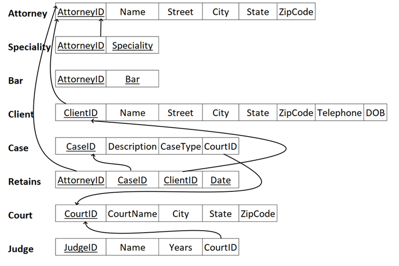
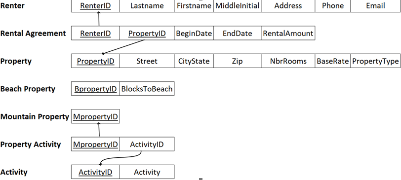

In ER Diagram, for an entity referring to a weak entitiy, have a FK pointing to:
- primary key of weak entity
- primary key of the superclass of weak entitiy in the weak entity
- primary key of the superclass of weak entitiy in the *superclass*
For the weak entity, the primary key is composite key of its own primary key and its superclass primary key

For such a table, bar, date and specialty are multivalued attributes
Multivalued attributes need to have a primary key which is a composite key of its value and the primary key of the entity it belongs to

For such a table, rental agreement is N to M relationship between renter and property, the MpropertyID and BpropertyID should not be in the diagram. Lastly, property activity is a 1:N RELATIONSHIP where 1 refers to the mountain property (since it is the primary key).