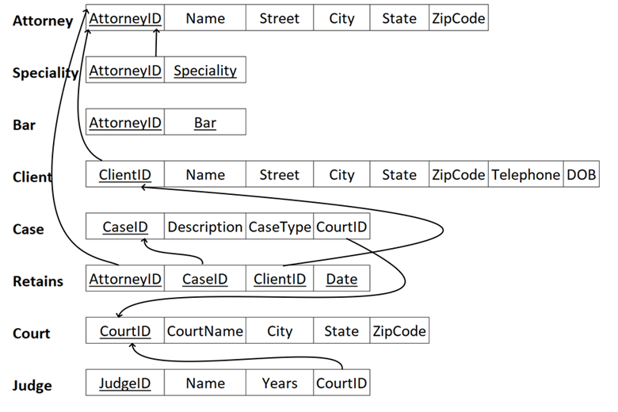
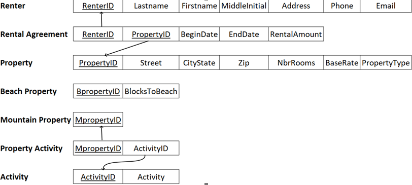

# Y6 Database and Frontend Module
 what is a firebase sequel light

These instructions assume that you are using VScode to run this project

Change directory to where the project folder is located using 
```
cd ./PATH/TO/FOLDER
```
Run 
```
npm install
``` 
This should install all dependancies needed. Run 
```
node -v
```
to check if node is recognised If not, follow the instructions on https://hackmd.io/@hm222vx/AddNodeJSPath.

Lastly, run 
```
npm run dev
```
to start the server. It should be located on http://localhost:3000 and will also be displayed on the terminal. In the event that node is not recognised in the powershell terminal specifically, search online for the command to manually add it to powershell.


## To run SQL
```sql
-- PrettyTable dependancy has deprecated the default style so needs to be explicitly configured
%config SqlMagic.style = '_DEPRECATED_DEFAULT'
```

## Notes
In ER Diagram, for an entity referring to a weak entitiy, have a FK pointing to:
- primary key of weak entity
- primary key of the superclass of weak entitiy in the weak entity
- primary key of the superclass of weak entitiy in the *superclass*
For the weak entity, the primary key is composite key of its own primary key and its superclass primary key


For such a table, bar, date and specialty are multivalued attributes
Multivalued attributes need to have a primary key which is a composite key of its value and the primary key of the entity it belongs to


For such a table, rental agreement is N to M relationship between renter and property, the MpropertyID and BpropertyID should not be in the diagram. Lastly, property activity is a 1:N RELATIONSHIP where 1 refers to the mountain property (since it is the primary key).